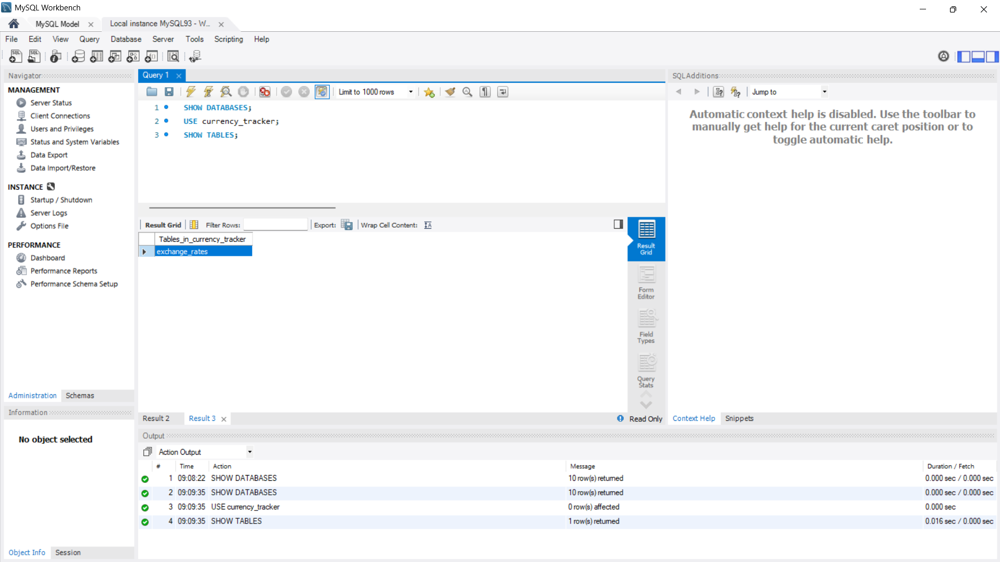
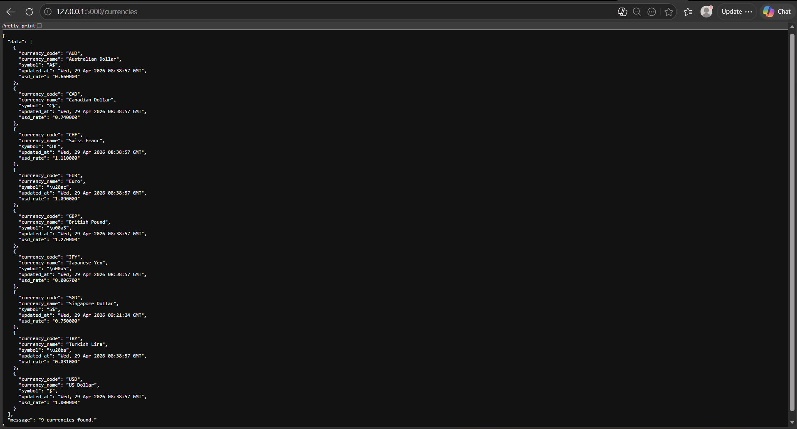
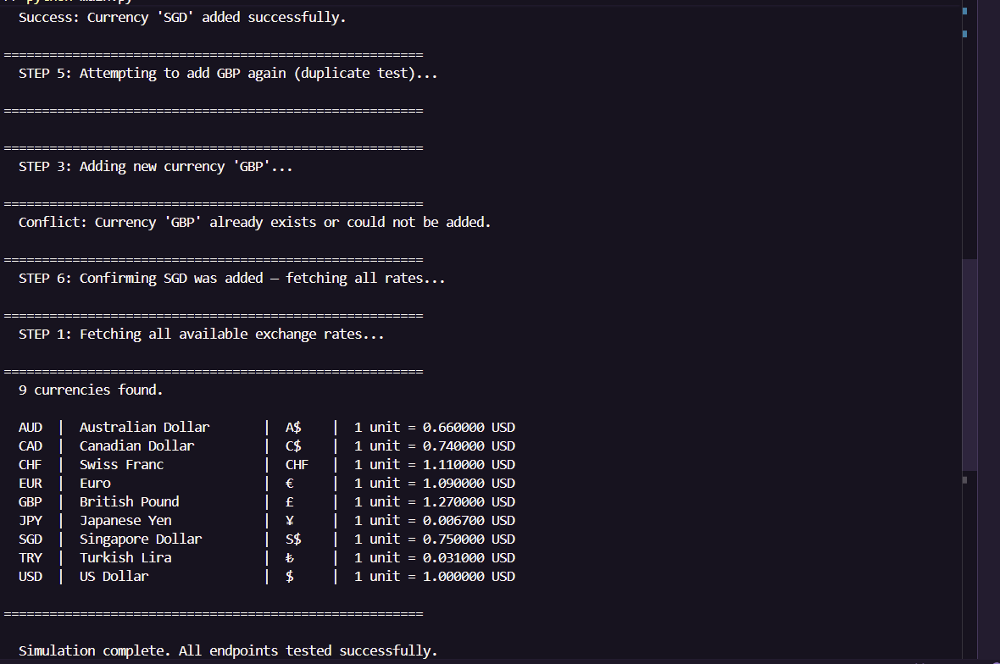
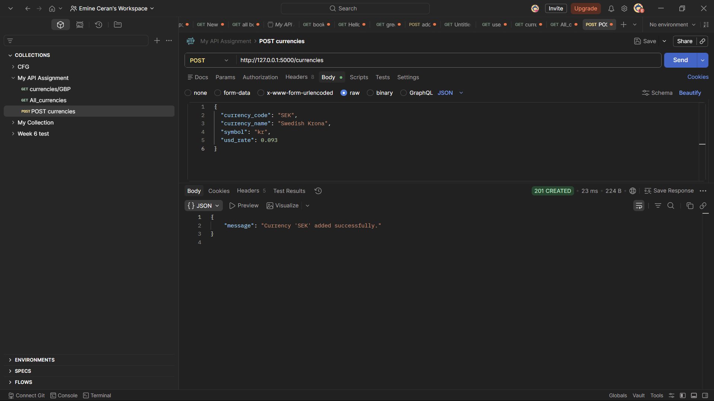
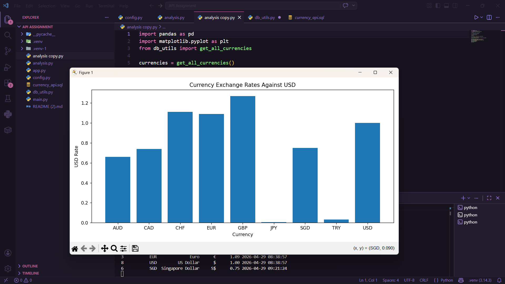

```markdown
# Currency Tracker API

A simple REST API built with Flask and MySQL for storing and retrieving currency exchange rates against the US Dollar.

This project was completed as part of CFG Data Science — Topic Assignment 4.

---

## Project Structure

```bash
currency_api/
├── analysis.py         # Simple visualisation using pandas & matplotlib 
├── app.py              # Flask API routes/endpoints
├── db_utils.py         # MySQL connection and database query functions
├── config.py           # Local database credentials - not for GitHub
├── main.py             # Client-side script to test the API
├── currency_api.sql    # Database and table setup script
└── README.md           # Project documentation
```

---

## Features

- Retrieve all stored exchange rates
- Search for a single currency by currency code
- Add a new currency exchange rate
- Handle missing currencies
- Prevent duplicate currency codes
- Return responses in JSON format

---

## Setup Instructions

### 1. Install required packages

```bash
pip install flask mysql-connector-python requests
````

### 2. Set up the database

Open MySQL Workbench and run the `currency_api.sql` script.

This will:

* create the `currency_tracker` database
* create the `exchange_rates` table
* insert starter currencies such as USD, GBP, EUR, JPY, CHF, CAD, AUD and TRY

### 3. Configure database credentials

Database credentials are loaded securely using environment variables via a `.env` file.

Do not store sensitive data directly in the source code.

## Environment Variables (.env)

Create a `.env` file in the root of your project and add:

DB_HOST=localhost
DB_USER=root
DB_PASSWORD=your_password_here
DB_NAME=currency_tracker

!! The `.env` file is not included in this repository for security reasons.

A sample configuration file (`config_example.py`) is provided as a reference.

Sensitive files such as `.env` and `config.py` are excluded using `.gitignore` to ensure security.

## Running the Project

### Step 1 — Start the Flask API

```bash
python app.py
```

Expected output:

```text
Running on http://127.0.0.1:5000
```

### Step 2 — Run the client simulation

Open a second terminal in the same folder and run:

```bash
python main.py
```

The client simulation tests:

* retrieving all exchange rates
* retrieving GBP by currency code
* handling a missing currency code
* adding SGD as a new currency
* handling a duplicate GBP insert
* confirming the updated currency list

---

## API Endpoints

| Method | Endpoint             | Description                             |
|--------|----------------------|-----------------------------------------|
| GET    | `/`                  | Welcome message and available endpoints |
| GET    | `/currencies`        | Returns all exchange rates              |
| GET    | `/currencies/<code>` | Returns one currency by code            |
| POST   | `/currencies`        | Adds a new currency exchange rate       |

## Error Handling

The API includes basic error handling:

- Returns 404 if a currency is not found
- Returns 400 for invalid input data
- Returns 409 for duplicate entries
- Returns 500 for database errors
---

## Example POST Request

Endpoint:

```text
POST /currencies
```

Request body:

```json
{
  "currency_code": "SGD",
  "currency_name": "Singapore Dollar",
  "symbol": "S$",
  "usd_rate": 0.75
}
```

---

## Example Responses

### GET /currencies

```json
{
  "message": "8 currencies found.",
  "data": [
    {
      "currency_code": "GBP",
      "currency_name": "British Pound",
      "symbol": "£",
      "usd_rate": 1.27,
      "updated_at": "2026-04-10 00:00:00"
    }
  ]
}
```

### GET /currencies/XYZ

```json
{
  "error": "Currency 'XYZ' not found."
}
```

### Duplicate currency

```json
{
  "error": "Currency 'GBP' already exists or could not be added."
}
```

---

## Technologies Used

* Python
* Flask
* MySQL
* MySQL Connector/Python
* Requests
* JSON
* python-dotenv
* Pandas
* Matplotlib
---

## Learning Outcomes

This project demonstrates the ability to:

* design and build a RESTful API using Flask
* connect a Python application to a MySQL database
* perform CRUD operations (read and insert data)
* handle HTTP requests and responses (GET and POST)
* structure and return data in JSON format
* implement basic error handling for API endpoints
* test API functionality using both Postman and a client-side Python script
* apply secure practices using environment variables (.env)

---

## Optional Analysis

An additional script demonstrates how API data can be used for basic data analysis and visualisation.

Using pandas and matplotlib, exchange rates are processed and visualised to show their relative value against USD.

This highlights how backend API data can be extended into simple data science workflows.
---

## Screenshots

### Database Setup — MySQL Workbench

The database was created successfully in MySQL Workbench, including the `currency_tracker` database and the `exchange_rates` table.



---

### API Response — GET /currencies

The `/currencies` endpoint returns exchange rate data in JSON format.



---

### Client Simulation Output

The client-side script tests all main API actions, including retrieving currencies, adding SGD, and handling a duplicate GBP entry.



---
---

## API Testing with Postman

The API was tested using Postman to simulate real-world HTTP requests.

### Example — Adding a New Currency (POST Request)

A POST request was sent to the `/currencies` endpoint with a JSON body:

```json
{
  "currency_code": "SEK",
  "currency_name": "Swedish Krona",
  "symbol": "kr",
  "usd_rate": 0.093
}
```

The API successfully returned:

```json
{
  "message": "Currency 'SEK' added successfully."
}
```

### Postman Screenshot



---

### Optional Data Visualisation

An optional analysis script uses pandas and matplotlib to visualise exchange rates against USD.

